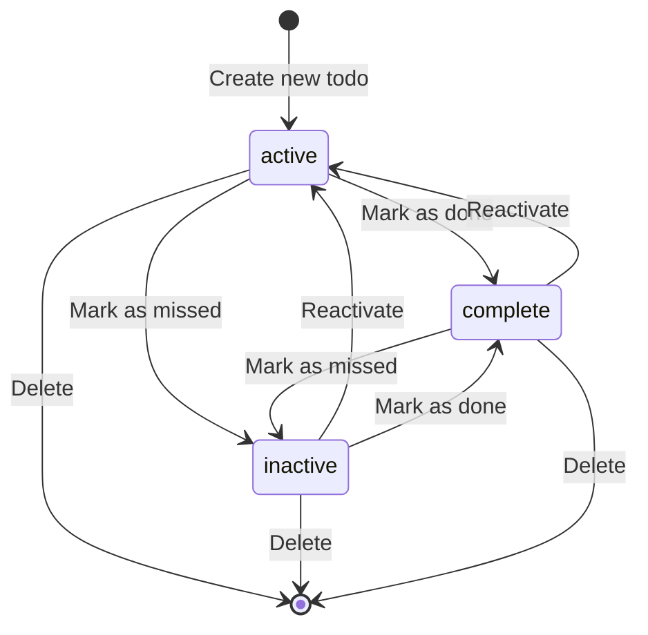

# Data Model: Todo List

**Feature**: Todo List with Status Management
**Date**: 2025-10-26
**Purpose**: Define data structures, validation rules, and state transitions

## Entity: Todo

### TypeScript Interface

```typescript
/**
 * Todo item with status management
 */
export interface Todo {
  /** Unique identifier (UUID v4) */
  id: string;

  /** Clerk user ID (owner of todo) */
  userId: string;

  /** Todo title (required, 1-100 chars) */
  title: string;

  /** Detailed description (required, max 500 chars) */
  description: string;

  /** Icon name from lucide-react-native (required) */
  icon: string;

  /** Current status of the todo */
  status: TodoStatus;

  /** Due date/time (required, ISO 8601 string) */
  dueDate: string;

  /** Creation timestamp (ISO 8601) */
  createdAt: string;

  /** Last modification timestamp (ISO 8601) */
  updatedAt: string;
}

/**
 * Todo status enumeration
 */
export type TodoStatus = 'active' | 'inactive' | 'complete';

/**
 * Status display names (for UI)
 */
export const TODO_STATUS_LABELS: Record<TodoStatus, string> = {
  active: 'Active',
  inactive: 'Terlewat', // Indonesian for "missed" or "skipped"
  complete: 'Complete'
};

/**
 * Available icon options for todos
 */
export const TODO_ICON_OPTIONS = [
  // Productivity
  'CheckSquare', 'Clipboard', 'ListTodo', 'FileText',
  // Time
  'Calendar', 'Clock', 'Timer', 'AlarmClock',
  // Priority
  'Star', 'Flag', 'AlertCircle', 'AlertTriangle',
  // Categories
  'Home', 'Briefcase', 'ShoppingCart', 'Heart', 'Coffee',
  // Actions
  'Play', 'Pause', 'Repeat', 'CheckCircle', 'XCircle',
  // Other
  'Lightbulb', 'MessageCircle', 'Phone', 'Mail', 'Book'
] as const;

export type TodoIcon = typeof TODO_ICON_OPTIONS[number];
```

### Field Specifications

| Field | Type | Required | Constraints | Default | Notes |
|-------|------|----------|-------------|---------|-------|
| `id` | string | Yes | UUID v4 format | Generated | Immutable after creation |
| `userId` | string | Yes | Clerk user ID | From auth | Immutable, for data isolation |
| `title` | string | Yes | 1-100 characters, no leading/trailing whitespace | - | Primary display text |
| `description` | string | Yes | Max 500 characters | - | Required detailed description |
| `icon` | string | Yes | Must be in `TODO_ICON_OPTIONS` | 'CheckSquare' | lucide-react-native icon name |
| `status` | TodoStatus | Yes | 'active' \| 'inactive' \| 'complete' | 'active' | Current state |
| `dueDate` | string | Yes | ISO 8601 datetime | - | Required due date/time |
| `createdAt` | string | Yes | ISO 8601 datetime | Generated | Immutable timestamp |
| `updatedAt` | string | Yes | ISO 8601 datetime | Generated | Updated on every modification |

### Validation Rules

#### Title Validation
```typescript
function validateTitle(title: string): string | null {
  const trimmed = title.trim();

  if (trimmed.length === 0) {
    return 'Title is required';
  }

  if (trimmed.length > 100) {
    return 'Title must be 100 characters or less';
  }

  return null; // Valid
}
```

#### Description Validation
```typescript
function validateDescription(description: string): string | null {
  if (!description || description.trim().length === 0) {
    return 'Description is required';
  }

  if (description.length > 500) {
    return 'Description must be 500 characters or less';
  }

  return null; // Valid
}
```

#### Icon Validation
```typescript
function validateIcon(icon: string): string | null {
  if (!icon) {
    return 'Icon is required';
  }

  if (!TODO_ICON_OPTIONS.includes(icon as TodoIcon)) {
    return 'Invalid icon selection';
  }

  return null; // Valid
}
```

#### Due Date Validation
```typescript
function validateDueDate(dueDate: string): string | null {
  if (!dueDate) {
    return 'Due date is required';
  }

  try {
    const date = new Date(dueDate);
    if (isNaN(date.getTime())) {
      return 'Invalid date format';
    }

    // Warning only (not error) if date is in the past
    const now = new Date();
    if (date < now) {
      return 'Warning: Due date is in the past';
    }

    return null; // Valid
  } catch (e) {
    return 'Invalid date format';
  }
}
```

### Status Transitions



**Allowed Transitions**:
- `active` → `complete`: User completes task
- `active` → `inactive`: User skips/misses task
- `inactive` → `active`: User wants to retry
- `inactive` → `complete`: User marks skipped task as done
- `complete` → `active`: User wants to redo task
- `complete` → `inactive`: User marks completed task as skipped
- Any status → *deleted*: User removes todo

**No Restrictions**: All status transitions are bidirectional. Users have full control.

### Business Rules

1. **Creation**:
   - New todos always start with `status: 'active'`
   - `id` generated using `crypto.randomUUID()`
   - `createdAt` and `updatedAt` set to current timestamp
   - `userId` from authenticated Clerk session

2. **Update**:
   - Only owner (`userId` match) can modify todo
   - `updatedAt` timestamp refreshed on every change
   - `createdAt` and `id` are immutable

3. **Status Change**:
   - Status changes update `updatedAt`
   - No validation on status transitions (all allowed)
   - Status change does not affect other fields

4. **Deletion**:
   - Hard delete (no soft delete/archiving)
   - Only owner can delete
   - Deletion is permanent (no undo)

5. **Ordering**:
   - Within each status, todos ordered by `createdAt` descending (newest first)
   - Alternative sort: by `dueDate` ascending (optional enhancement)

### Convex Mutation Argument Shapes

#### Create Todo Arguments (Convex Mutation)
```typescript
// Used with: useMutation(api.todos.create)
export interface CreateTodoArgs {
  title: string; // Required, 1-100 characters
  description: string; // Required, max 500 characters
  icon: string; // Required, must be from TODO_ICON_OPTIONS
  dueDate: string; // Required, ISO 8601 datetime
}

// Usage example:
// const createTodo = useMutation(api.todos.create);
// await createTodo({ title, description, icon, dueDate });
```

#### Update Todo Arguments (Convex Mutation)
```typescript
// Used with: useMutation(api.todos.update)
export interface UpdateTodoArgs {
  id: Id<"todos">; // Convex document ID
  title?: string;
  description?: string;
  icon?: string;
  dueDate?: string;
  // Note: status updated via separate changeStatus mutation
}

// Usage example:
// const updateTodo = useMutation(api.todos.update);
// await updateTodo({ id: todoId, title: "Updated" });
```

#### Change Status Arguments (Convex Mutation)
```typescript
// Used with: useMutation(api.todos.changeStatus)
export interface ChangeStatusArgs {
  id: Id<"todos">; // Convex document ID
  status: TodoStatus;
}

// Usage example:
// const changeStatus = useMutation(api.todos.changeStatus);
// await changeStatus({ id: todoId, status: "complete" });
```

#### Query Results (Convex Queries)
```typescript
// useQuery(api.todos.list) returns Todo[]
// useQuery(api.todos.listByStatus, { status: "active" }) returns Todo[]
// useQuery(api.todos.get, { id: todoId }) returns Todo | null

// No wrapper objects - Convex returns data directly
```

### Sample Data

**Note**: Sample data is created via Convex mutation in `convex/todos.ts`. IDs are auto-generated by Convex.

```typescript
// Example Convex mutation for initializing sample data
// See convex/todos.ts for implementation

const SAMPLE_TODOS_DATA = [
  {
    title: 'Welcome to Todo List!',
    description: 'This is your first todo. Try changing its status or editing it.',
    icon: 'CheckSquare',
    status: 'active',
    dueDate: new Date(Date.now() + 86400000).toISOString(), // Tomorrow
  },
  {
    title: 'Learn Convex',
    description: 'Understand real-time database with TypeScript functions',
    icon: 'Book',
    status: 'complete',
    dueDate: new Date(Date.now() - 86400000).toISOString(), // Yesterday
  },
  {
    title: 'Missed deadline',
    description: 'This was supposed to be done yesterday',
    icon: 'AlertTriangle',
    status: 'inactive',
    dueDate: new Date(Date.now() - 86400000).toISOString(), // Yesterday
  }
];

// Convex automatically adds:
// - _id (Convex document ID, type: Id<"todos">)
// - _creationTime (Unix timestamp in milliseconds)
// Our schema also includes:
// - userId (from ctx.auth.getUserIdentity().subject)
// - createdAt, updatedAt (ISO 8601 strings)
```

### Convex Schema Reference

**Backend**: Convex Cloud (managed database with real-time sync)

The complete Convex schema definition is in `convex/schema.ts`:

```typescript
// convex/schema.ts
import { defineSchema, defineTable } from "convex/server";
import { v } from "convex/values";

export default defineSchema({
  todos: defineTable({
    userId: v.string(),        // Clerk identity.subject
    title: v.string(),          // Required, 1-100 characters
    description: v.string(),    // Required, max 500 characters
    icon: v.string(),           // Required, must be from TODO_ICON_OPTIONS
    status: v.union(
      v.literal("active"),
      v.literal("inactive"),
      v.literal("complete")
    ),
    dueDate: v.string(),        // Required, ISO 8601 datetime
    createdAt: v.string(),      // ISO 8601 timestamp
    updatedAt: v.string(),      // ISO 8601 timestamp
  })
    .index("by_user", ["userId"])
    .index("by_user_and_status", ["userId", "status"]),
});
```

**Indexes**:
- `by_user`: Query all todos for a specific user
- `by_user_and_status`: Query todos filtered by user and status (for tab filtering)

**See**: `/specs/001-todo-list-status/contracts/convex-schema.md` for complete API documentation
